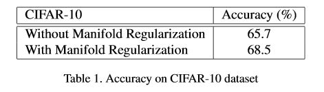
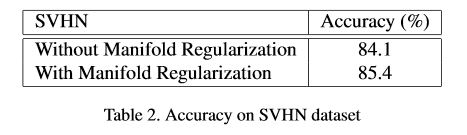
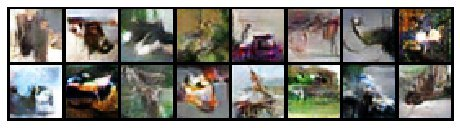
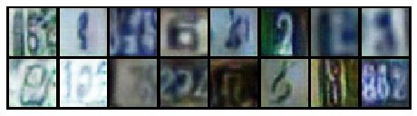

# Semi-Supervised Learning With GANs: Revisiting Manifold Regularization

This repository contains a PyTorch implementation of the paper [Semi-Supervised Learning With GANs: Revisiting Manifold Regularization] (https://arxiv.org/abs/1805.08957) by Bruno Lecouat, Chuan Sheng Foo, Houssam Zenati, Vijay Ramaseshan Chandrasekhar.

The tables below show that manifold regularization increases the classification accuracy on CIFAR-10 and SVHN datasets. We used 400 and 100 labeled examples per class respectively. Due to constraints, training was stopped at 254 and 105 epoch respectively. This was enough to demonstrate the effect of manifold regularization but higher accuracies are possible with more training (according to the original paper).

Examples of the generated images are shown below. As expected, they do not look visually appealing like in conventional GANs. Good semi-supervised classification performance requires a bad generator.

